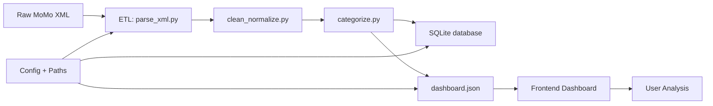

# Architecture Diagram

```mermaid
flowchart LR
    A[Raw MoMo XML] --> B[ETL: parse_xml.py]
    B --> C[clean_normalize.py]
    C --> D[categorize.py]
    D --> E[SQLite database]
    D --> F[dashboard.json]
    F --> G[Frontend Dashboard]
    G --> H[User Analysis]

    I[Config + Paths] --> B
    I --> E
    I --> F
```

This diagram shows the end-to-end flow from raw XML ingestion through ETL processing, storage, and dashboard presentation.
